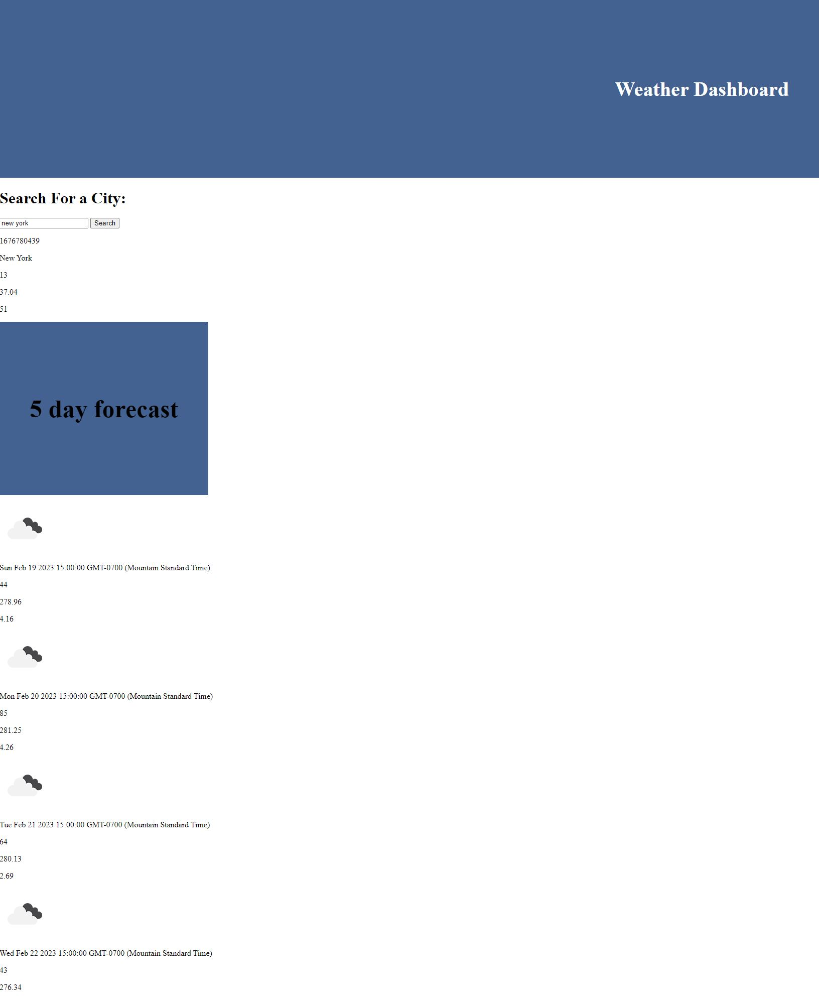

# <myVeryCoolWeatherDashboard>

## Description

a current and 5 day forecast website that uses an api to find current and future data. 

## Table of Contents (Optional)

N/A

## Installation

N/A

## Usage

type a city into the search box and let this website do its magic!

## Credits

N/A

## License

MIT

## Badges

N/A

## Features

N/A

## How to Contribute

N/A

## Tests

N/A

## Link to Deployed Site

https://22slore.github.io/myVeryCoolWeatherDashboard/

## Screenshots

